# easy-control

A simple and easy-to-use Python package for various controllable text-to-image diffusion models, useful for quickly establishing a baseline for your paper or project.

Note: We only provide the basic usage of these models, for more advanced features, please refer to their original repositories.

Warning: The models are not fully tested, feel free to report any issues.


## Installation

> The code is tested with python 3.12.8, torch 2.5.1 and cuda 12.4.

Clone the repository:

```shell
git clone https://github.com/xyfJASON/easy-control.git
cd easy-control
```

Create and activate a conda environment:

```shell
conda create -n easy-control python=3.12
conda activate easy-control
```

Install the dependencies:

```shell
pip install -r requirements.txt
```


## Usage

### ControlNet ([arXiv](https://arxiv.org/abs/2302.05543) | [GitHub](https://github.com/lllyasviel/ControlNet))

```python
from easy_control import ControlNet

controlnet = ControlNet(
    pretrained_model_name_or_path="runwayml/stable-diffusion-v1-5",
    control_model_name_or_path="lllyasviel/control_v11p_sd15_canny",
    device="cuda",
)
result = controlnet.sample(
    control_image="./test_images/rabbit-canny.png",
    prompt="a rabbit in the forest",
    negative_prompt="worst quality",
)
result.show()
```

|                        control                         |                     result 1                      |                     result 2                      |
|:------------------------------------------------------:|:-------------------------------------------------:|:-------------------------------------------------:|
| 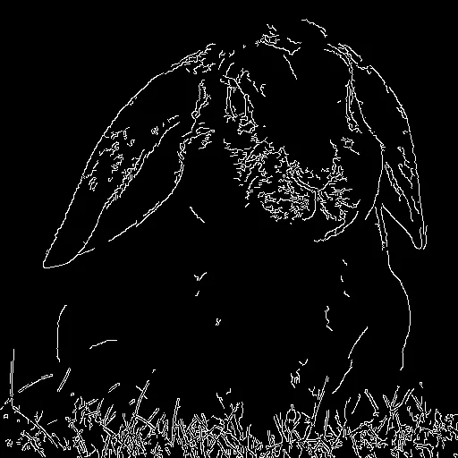 | 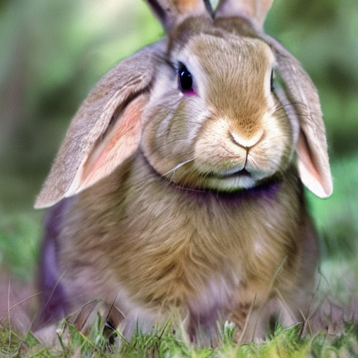 | 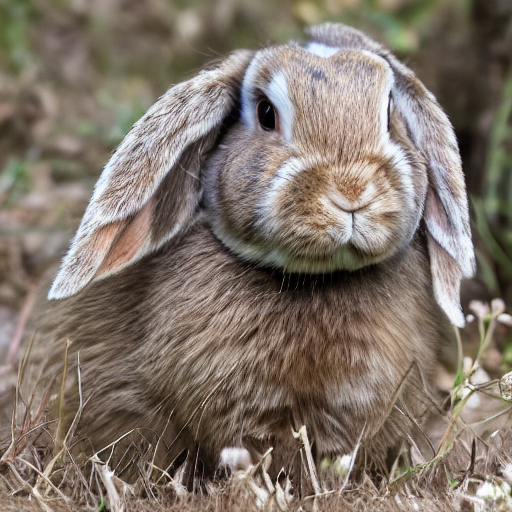 |

```python
from easy_control import ControlNetSDXL

controlnet = ControlNetSDXL(
    pretrained_model_name_or_path="stabilityai/stable-diffusion-xl-base-1.0",
    control_model_name_or_path="diffusers/controlnet-canny-sdxl-1.0",
    vae_model_name_or_path="madebyollin/sdxl-vae-fp16-fix",
    device="cuda",
)
result = controlnet.sample(
    control_image="./test_images/couple-canny.png",
    prompt="a couple watching a romantic sunset, 4k photo",
    negative_prompt="worst quality",
)
result.show()
```

|                        control                         |                        result 1                        |                        result 2                        |
|:------------------------------------------------------:|:------------------------------------------------------:|:------------------------------------------------------:|
| 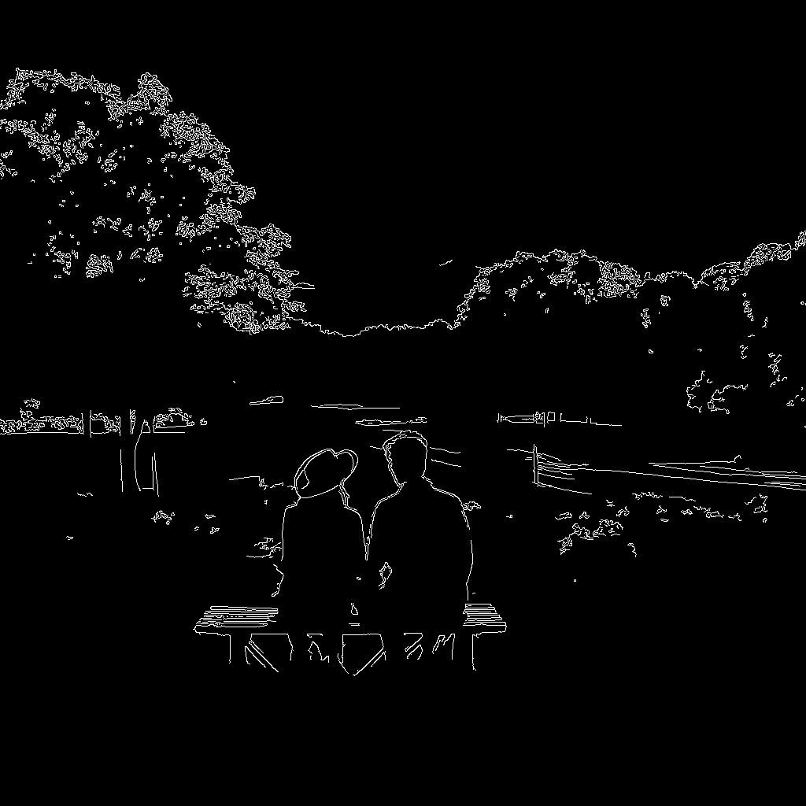 |  |  |


### T2I-Adapter ([arXiv](https://arxiv.org/abs/2302.08453) | [GitHub](https://github.com/TencentARC/T2I-Adapter))

```python
from easy_control import T2IAdapter

t2iadapter = T2IAdapter(
    pretrained_model_name_or_path="runwayml/stable-diffusion-v1-5",
    adapter_model_name_or_path="TencentARC/t2iadapter_depth_sd15v2",
    device="cuda",
)
result = t2iadapter.sample(
    control_image="./test_images/city-depth.png",
    prompt="a photo of a city at night, stars in the sky",
    negative_prompt="worst quality",
)
result.show()
```

|                       control                        |                     result 1                      |                     result 2                      |
|:----------------------------------------------------:|:-------------------------------------------------:|:-------------------------------------------------:|
|  |  |  |

```python
from easy_control import T2IAdapterSDXL

t2iadapter = T2IAdapterSDXL(
    pretrained_model_name_or_path="stabilityai/stable-diffusion-xl-base-1.0",
    adapter_model_name_or_path="TencentARC/t2i-adapter-depth-midas-sdxl-1.0",
    vae_model_name_or_path="madebyollin/sdxl-vae-fp16-fix",
    variant="fp16",
    device="cuda",
)
result = t2iadapter.sample(
    control_image="./test_images/lecture-depth.png",
    prompt="a toy spiderman giving a lecture, photorealistic",
    negative_prompt="worst quality",
)
result.show()
```

|                         control                         |                        result 1                        |                        result 2                        |
|:-------------------------------------------------------:|:------------------------------------------------------:|:------------------------------------------------------:|
|  |  |  |


### UniControl  ([arXiv](https://arxiv.org/abs/2305.11147) | [GitHub](https://github.com/salesforce/UniControl))

```shell
# Download pretrained models
mkdir -p ./ckpts/unicontrol
wget https://storage.googleapis.com/sfr-unicontrol-data-research/unicontrol.ckpt -O ./ckpts/unicontrol/unicontrol.ckpt
wget https://storage.googleapis.com/sfr-unicontrol-data-research/unicontrol_v1.1.ckpt -O ./ckpts/unicontrol/unicontrol_v1.1.ckpt
```

```python
from easy_control import UniControl

unicontrol = UniControl(
    pretrained_model_path="./ckpts/unicontrol/unicontrol_v1.1.ckpt",
    task_name="seg",
    version="v1.1",
    device="cuda",
)
result = unicontrol.sample(
    control_image="./test_images/scenery-segmentation.png",
    prompt="a beautiful landscape in winter",
    positive_prompt="best quality, extremely detailed",
    negative_prompt="worst quality",
)
result.show()
```

|                            control                             |                     result 1                      |                     result 2                      |
|:--------------------------------------------------------------:|:-------------------------------------------------:|:-------------------------------------------------:|
|  |  |  |


### Uni-ControlNet ([arXiv](https://arxiv.org/abs/2305.16322) | [GitHub](https://github.com/ShihaoZhaoZSH/Uni-ControlNet))

```shell
# Download pretrained models
mkdir -p ./ckpts/uni_controlnet
huggingface-cli download shihaozhao/uni-controlnet uni.ckpt --local-dir ./ckpts/uni_controlnet
```

```python
from easy_control import UniControlNet

unicontrolnet = UniControlNet(
    pretrained_model_path="./ckpts/uni_controlnet/uni.ckpt",
    task_name="canny",
    device="cuda",
)
result = unicontrolnet.sample(
    control_image="./test_images/rabbit-canny.png",
    content_image="./test_images/parrot.jpeg",
    prompt="a rabbit",
    positive_prompt="best quality, extremely detailed",
    negative_prompt="worst quality",
)
result.show()
```

|                        control                         |                      content                      |                        result                        |
|:------------------------------------------------------:|:-------------------------------------------------:|:----------------------------------------------------:|
|  | 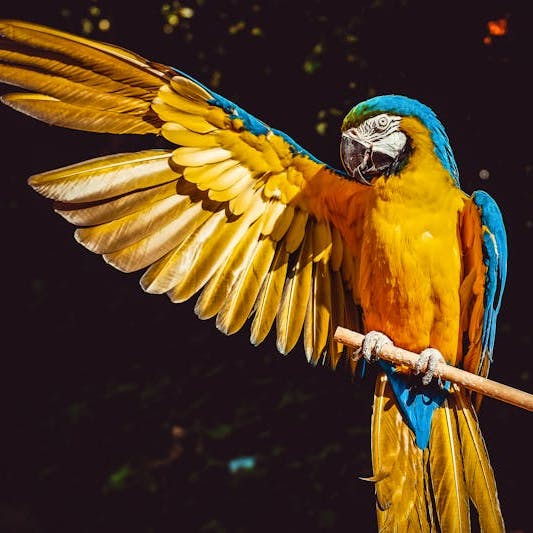 | 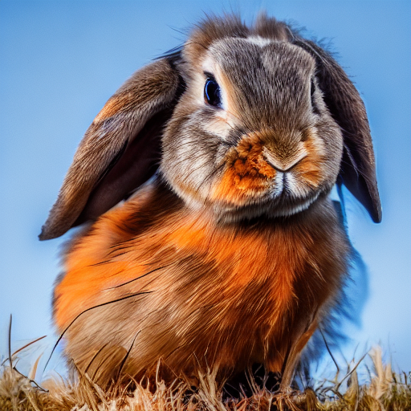 |


### ControlNet-Union (ControlNetPlus) ([GitHub](https://github.com/xinsir6/ControlNetPlus))

```python
from easy_control import ControlNetUnion

controlnet_union = ControlNetUnion(
    task_name="openpose",
    pretrained_model_name_or_path="stabilityai/stable-diffusion-xl-base-1.0",
    controlnet_union_model_name_or_path="xinsir/controlnet-union-sdxl-1.0",
    vae_model_name_or_path="madebyollin/sdxl-vae-fp16-fix",
    device="cuda",
)
result = controlnet_union.sample(
    control_image="./test_images/ski-openpose.png",
    prompt="an old man walking in wonderland",
    negative_prompt="worst quality, lowres, blurry",
)
result.show()
```

|                        control                         |                        result 1                         |                        result 2                         |
|:------------------------------------------------------:|:-------------------------------------------------------:|:-------------------------------------------------------:|
| 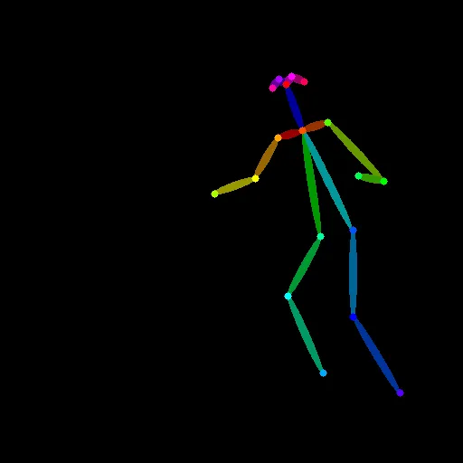 | 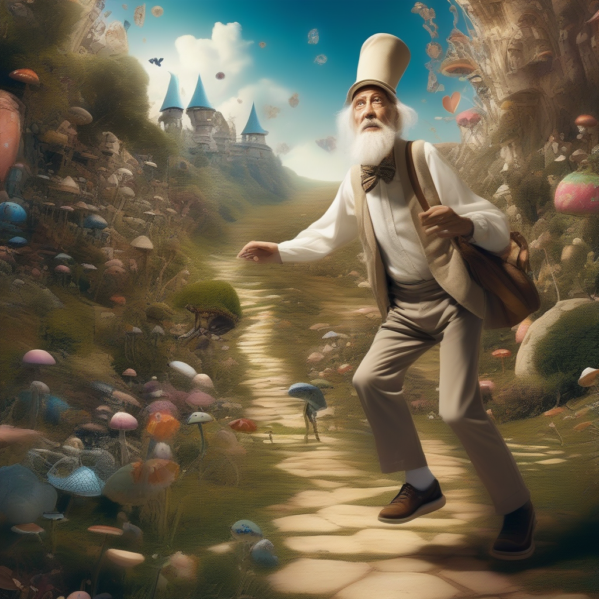 | 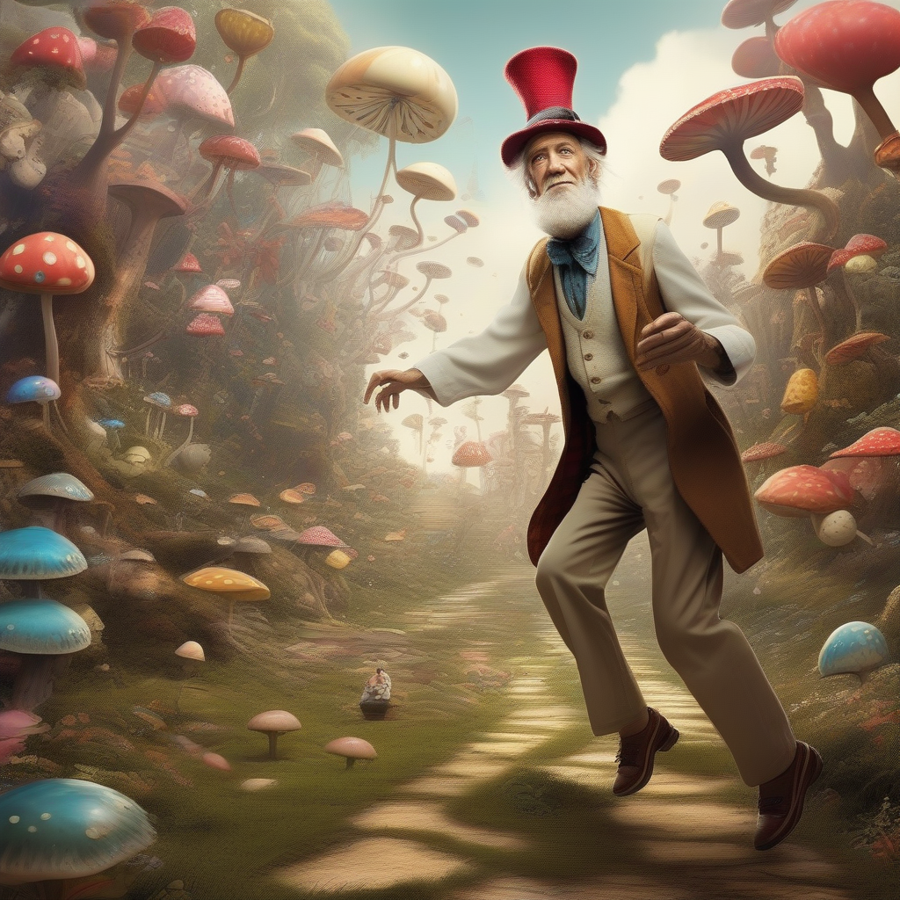 |


### ControlNet++ (ControlNetPlusPlus) ([arXiv](https://arxiv.org/abs/2404.07987) | [GitHub](https://github.com/liming-ai/ControlNet_Plus_Plus))

Download the pretrained models from [here](https://huggingface.co/limingcv/reward_controlnet/tree/main/checkpoints) and put them in `./ckpts/controlnet_plus_plus`.

```python
from easy_control import ControlNet

controlnet = ControlNet(
    pretrained_model_name_or_path="runwayml/stable-diffusion-v1-5",
    control_model_name_or_path="./ckpts/controlnet_plus_plus/canny/controlnet",
    device="cuda",
)
result = controlnet.sample(
    control_image="./test_images/rabbit-canny.png",
    prompt="a rabbit on the grass",
    negative_prompt="worst quality",
)
result.show()
```

|                        control                         |                          result 1                           |                          result 2                           |
|:------------------------------------------------------:|:-----------------------------------------------------------:|:-----------------------------------------------------------:|
|  | 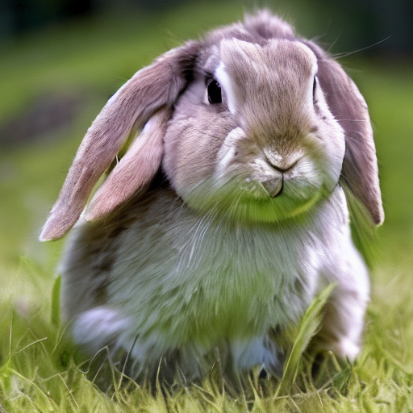 | 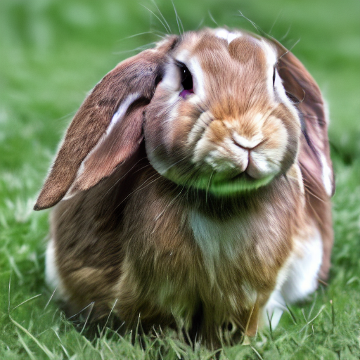 |


### Ctrl-X ([arXiv](https://arxiv.org/abs/2406.07540) | [GitHub](https://github.com/genforce/ctrl-x/tree/main) | [website](https://genforce.github.io/ctrl-x))

```python
from easy_control import CtrlX

ctrl_x = CtrlX(
    pretrained_model_name_or_path="stabilityai/stable-diffusion-xl-base-1.0",
    variant="fp16",
    device="cuda",
)
result = ctrl_x.sample(
    structure_image="./test_images/coffee-normal.png",
    appearance_image="./test_images/cat.jpeg",
    prompt="a cup of coffee",
    positive_prompt="high quality",
    negative_prompt="ugly, blurry, dark, low res, unrealistic",
)
result.show()
```

|                        structure                        |                   appearance                   |                   result                    |
|:-------------------------------------------------------:|:----------------------------------------------:|:-------------------------------------------:|
| 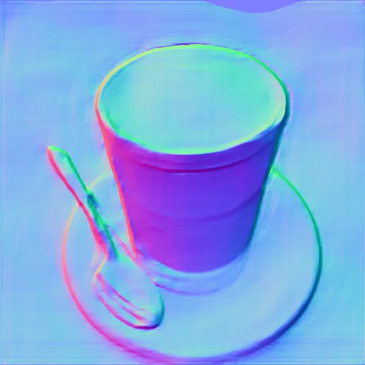 | 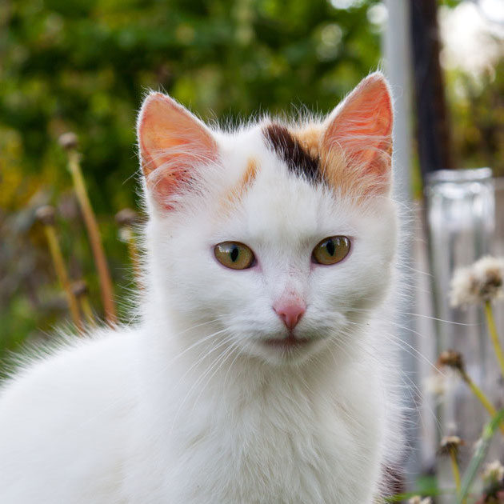 |  |


### ControlNeXt ([arXiv](https://arxiv.org/abs/2408.06070) | [GitHub](https://github.com/dvlab-research/ControlNeXt) | [website](https://pbihao.github.io/projects/controlnext/index.html))

```python
from easy_control import ControlNeXtSDXL

controlnext_sdxl = ControlNeXtSDXL(
    pretrained_model_name_or_path="stabilityai/stable-diffusion-xl-base-1.0",
    unet_model_name_or_path="Eugeoter/controlnext-sdxl-vidit-depth",
    controlnet_model_name_or_path="Eugeoter/controlnext-sdxl-vidit-depth",
    vae_model_name_or_path="madebyollin/sdxl-vae-fp16-fix",
    variant="fp16",
)
result = controlnext_sdxl.sample(
    control_image="./test_images/tower-depth-vidit.png",
    prompt="a diamond tower in the middle of a lava lake",
)
result.show()
```

|                           control                           |                        result 1                         |                        result 2                         |
|:-----------------------------------------------------------:|:-------------------------------------------------------:|:-------------------------------------------------------:|
| 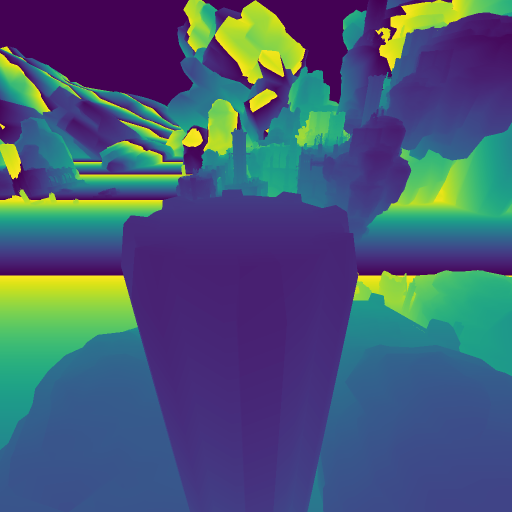 |  | 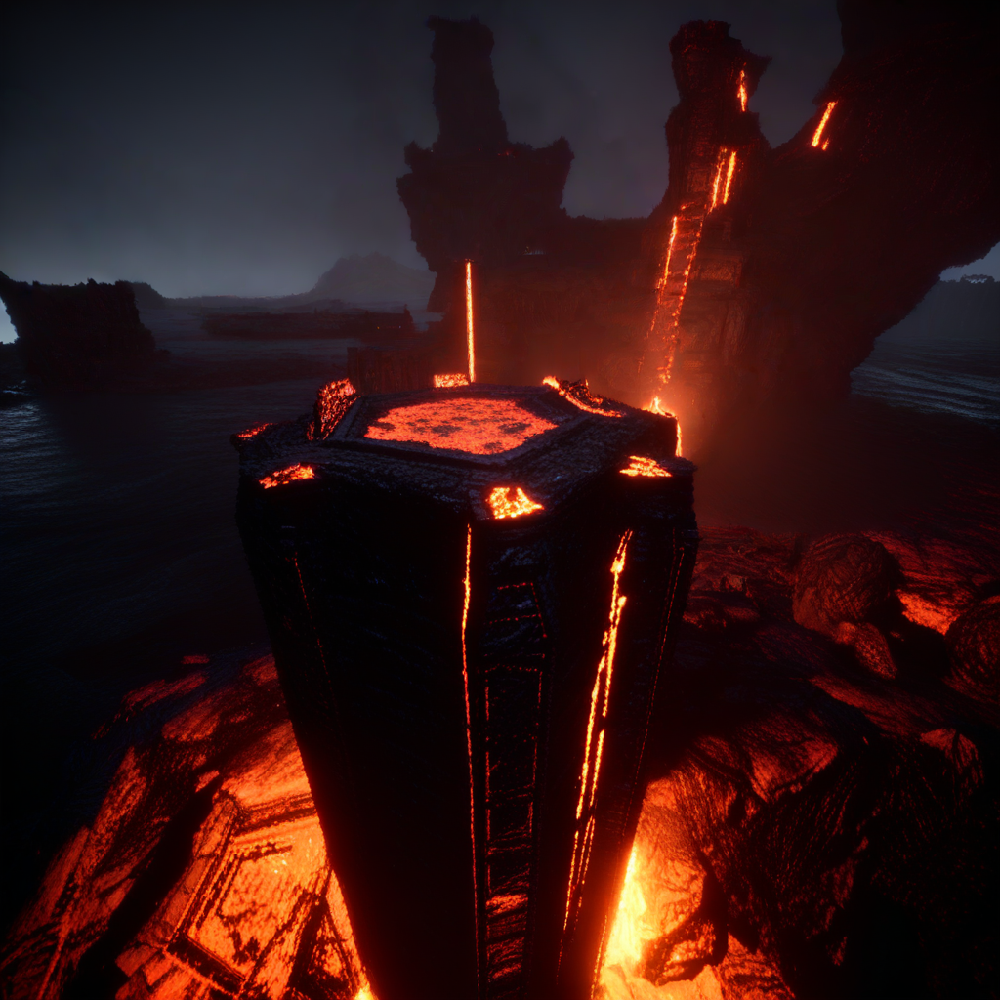 |


### OminiControl ([arXiv](https://arxiv.org/abs/2411.15098) | [GitHub](https://github.com/Yuanshi9815/OminiControl))

```python
from easy_control import OminiControl

ominicontrol = OminiControl(
    pretrained_model_name_or_path="black-forest-labs/FLUX.1-schnell",
    lora_model_name_or_path="Yuanshi/OminiControl",
    condition_type="canny",
    device="cuda",
)
result = ominicontrol.sample(
    control_image="./test_images/vase-canny.png",
    prompt="a vase with flowers",
)
result.show()
```

|                       control                        |                      result 1                       |                      result 2                       |
|:----------------------------------------------------:|:---------------------------------------------------:|:---------------------------------------------------:|
| 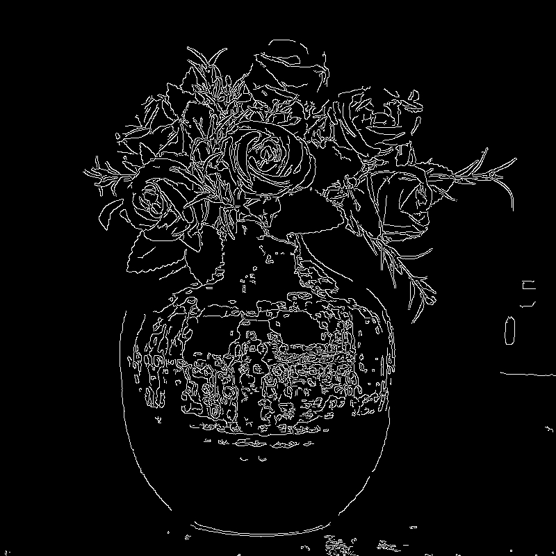 | 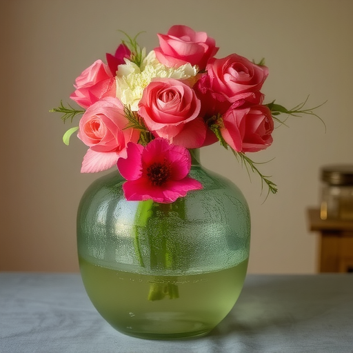 | 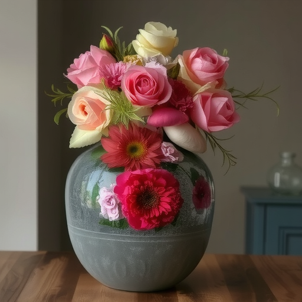 |


### EasyControl ([arXiv](https://arxiv.org/abs/2503.07027) | [GitHub](https://github.com/Xiaojiu-z/EasyControl))

```shell
# Download pretrained models
mkdir -p ./ckpts/easy_control
huggingface-cli download Xiaojiu-Z/EasyControl models/canny.safetensors --local-dir ./ckpts/easy_control
huggingface-cli download Xiaojiu-Z/EasyControl models/depth.safetensors --local-dir ./ckpts/easy_control
huggingface-cli download Xiaojiu-Z/EasyControl models/hedsketch.safetensors --local-dir ./ckpts/easy_control
huggingface-cli download Xiaojiu-Z/EasyControl models/inpainting.safetensors --local-dir ./ckpts/easy_control
huggingface-cli download Xiaojiu-Z/EasyControl models/pose.safetensors --local-dir ./ckpts/easy_control
huggingface-cli download Xiaojiu-Z/EasyControl models/seg.safetensors --local-dir ./ckpts/easy_control
huggingface-cli download Xiaojiu-Z/EasyControl models/subject.safetensors --local-dir ./ckpts/easy_control
huggingface-cli download Xiaojiu-Z/EasyControl models/Ghibli.safetensors --local-dir ./ckpts/easy_control
```

```python
from easy_control import EasyControl

easycontrol = EasyControl(
    pretrained_model_name_or_path="black-forest-labs/FLUX.1-dev",
    lora_path="./ckpts/easy_control/models",
    condition_type="pose",
    device="cuda",
)
result = easycontrol.sample(
    control_image="./test_images/ski-openpose.png",
    prompt="a girl playing football",
)
result.show()
```

|                        control                         |                      result 1                      |                      result 2                      |
|:------------------------------------------------------:|:--------------------------------------------------:|:--------------------------------------------------:|
|  | 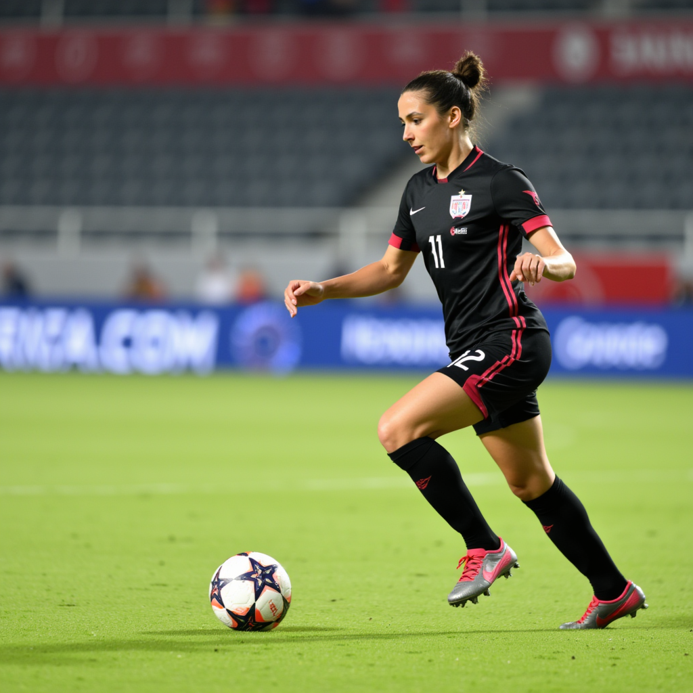 | 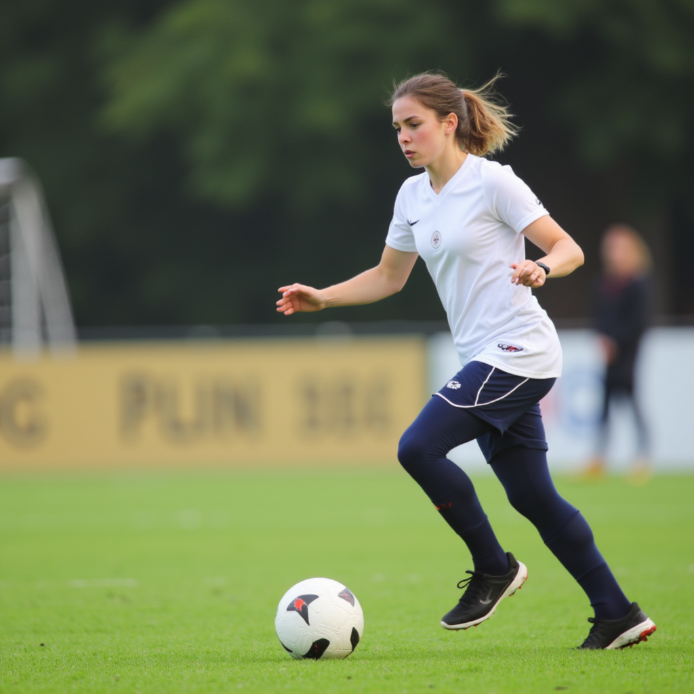 |


## References

```
@inproceedings{zhang2023adding,
  title={Adding conditional control to text-to-image diffusion models},
  author={Zhang, Lvmin and Rao, Anyi and Agrawala, Maneesh},
  booktitle={Proceedings of the IEEE/CVF International Conference on Computer Vision},
  pages={3836--3847},
  year={2023}
}
```

```
@inproceedings{mou2024t2i,
  title={T2i-adapter: Learning adapters to dig out more controllable ability for text-to-image diffusion models},
  author={Mou, Chong and Wang, Xintao and Xie, Liangbin and Wu, Yanze and Zhang, Jian and Qi, Zhongang and Shan, Ying},
  booktitle={Proceedings of the AAAI Conference on Artificial Intelligence},
  volume={38},
  number={5},
  pages={4296--4304},
  year={2024}
}
```

```
@article{qin2024unicontrol,
  title={UniControl: A Unified Diffusion Model for Controllable Visual Generation In the Wild},
  author={Qin, Can and Zhang, Shu and Yu, Ning and Feng, Yihao and Yang, Xinyi and Zhou, Yingbo and Wang, Huan and Niebles, Juan Carlos and Xiong, Caiming and Savarese, Silvio and others},
  journal={Advances in Neural Information Processing Systems},
  volume={36},
  year={2024}
}
```

```
@article{zhao2024uni,
  title={Uni-controlnet: All-in-one control to text-to-image diffusion models},
  author={Zhao, Shihao and Chen, Dongdong and Chen, Yen-Chun and Bao, Jianmin and Hao, Shaozhe and Yuan, Lu and Wong, Kwan-Yee K},
  journal={Advances in Neural Information Processing Systems},
  volume={36},
  year={2024}
}
```

```
@misc{xinsir6,
  title={ControlNet++: All-in-one ControlNet for image generations and editing!},
  author={xinsir6},
  url={https://github.com/xinsir6/ControlNetPlus},
  year={2024}
```

```
@inproceedings{li2025controlnet,
  title={ControlNet $$++ $$: Improving Conditional Controls with Efficient Consistency Feedback},
  author={Li, Ming and Yang, Taojiannan and Kuang, Huafeng and Wu, Jie and Wang, Zhaoning and Xiao, Xuefeng and Chen, Chen},
  booktitle={European Conference on Computer Vision},
  pages={129--147},
  year={2025},
  organization={Springer}
}
```

```
@inproceedings{lin2024ctrlx,
  title={Ctrl-X: Controlling Structure and Appearance for Text-To-Image Generation Without Guidance},
  author={Kuan Heng Lin and Sicheng Mo and Ben Klingher and Fangzhou Mu and Bolei Zhou},
  booktitle={The Thirty-eighth Annual Conference on Neural Information Processing Systems},
  year={2024},
  url={https://openreview.net/forum?id=ZulWEWQOp9}
}
```

```
@article{peng2024controlnext,
  title={Controlnext: Powerful and efficient control for image and video generation},
  author={Peng, Bohao and Wang, Jian and Zhang, Yuechen and Li, Wenbo and Yang, Ming-Chang and Jia, Jiaya},
  journal={arXiv preprint arXiv:2408.06070},
  year={2024}
}
```

```
@article{tan2024ominicontrol,
  title={Ominicontrol: Minimal and universal control for diffusion transformer},
  author={Tan, Zhenxiong and Liu, Songhua and Yang, Xingyi and Xue, Qiaochu and Wang, Xinchao},
  journal={arXiv preprint arXiv:2411.15098},
  volume={3},
  year={2024}
}
```
